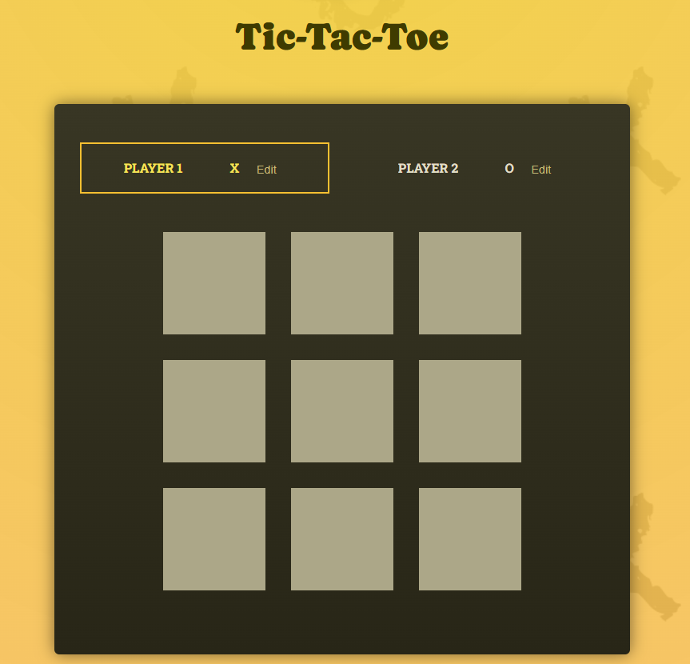

Sure! Below is a re-written README file for your Tic-Tac-Toe game project, incorporating emojis, enhanced formatting, links to social media, and an image. Feel free to customize it further to suit your project's style and content.

---

# Tic-Tac-Toe Game App 🎮

Welcome to the Tic-Tac-Toe Game App built with React! Challenge your friends or play against yourself in this classic game of strategy.

## Features 🌟

- **Two-Player Gameplay**: Take turns with a friend placing 'X' and 'O' symbols on the game board.

- **Dynamic Board Updates**: The game board updates in real-time as players make their moves.

- **Winning Detection**: The app automatically checks for winning combinations to declare a winner.

- **Player Customization**: Players can personalize their names during the game.

## Technologies Used 🚀

- **React**: Frontend development powered by React library for interactive user interfaces.

- **useState Hook**: Leveraging React's `useState` hook for managing game state.

- **Modern JavaScript**: Utilizing ES6+ features like arrow functions and spread syntax for efficient coding.

- **CSS Styling**: Styling with custom CSS (`index.css`) to create an attractive game interface.

- **GitHub**: Source code hosted on GitHub for version control and collaboration.

## How to Play 🕹️

1\. **Clone the Repository**:

   git clone https://github.com/Abdulrhman-Aliyan/Tic-Tac-Toe.git

2\. **Install Dependencies**:

   npm install

3\. **Start the Game**:

   npm start

4\. **Access the Game**:

   Open your web browser and go to `http://localhost:3000` to play Tic-Tac-Toe!

## Future Enhancements 🌈

- **Game Settings**: Add customizable options like board size and player names.

- **Animations**: Implement smooth animations for game transitions and interactions.

## Contributors 🌟

- [Abdulrhman Aliyan](https://github.com/Abdulrhman-Aliyan) 💻

## Connect with Us! 🌐

Follow us on social media for updates and more exciting projects:

- LinkedIn: [Abdulrahman Aliyan LinkedIn](https://www.linkedin.com/in/abdalrhman-aliyan-b0855416a/)

- Email: [Abdulrahman Aliyan E-mail](abdulrahmanaliyan@gmail.com)

---

Feel free to contribute to this project by submitting pull requests or reporting issues on GitHub. Let's make Tic-Tac-Toe even more fun and interactive together! 🚀

---

### Acknowledgments 🙏

I developed this Tic-Tac-Toe game with the invaluable knowledge gained from the [React - The Complete Guide (incl Hooks, React Router, Redux)](https://www.udemy.com/course/react-the-complete-guide-incl-redux/) course on Udemy, taught by Maximilian Schwarzmüller. This comprehensive course provided a solid foundation in React development, state management with Redux, and advanced React concepts, which were instrumental in building this project.

### Learning Reflection 🌱

Building this Tic-Tac-Toe game was an exciting application of the skills and techniques learned throughout the course. Concepts such as component composition, state management, and functional components with hooks greatly influenced the architecture of this project. I'm grateful for the clear explanations and hands-on exercises that enabled me to create interactive React applications confidently.